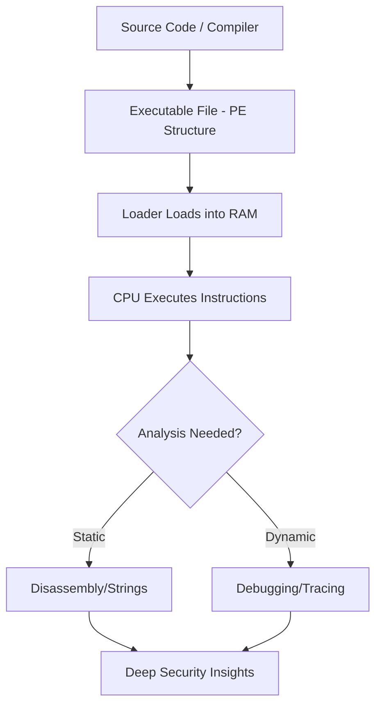

# 📂 Phase 01: Fundamentals of Reverse Engineering

> *"Reverse Engineering bukan sekadar 'membongkar' program; ini adalah seni untuk memahami arsitektur di balik logika digital. Di fase ini, kita akan membangun fondasi mental dan teknis yang diperlukan untuk menjadi seorang Security Researcher."*

---

## 📖 Ringkasan Eksekutif
Fase ini merupakan **Phase Zero** dalam perjalanan kita. Sebelum kita menyentuh *debugger* tingkat lanjut atau menganalisis malware kompleks, kita wajib menguasai "bahasa ibu" dari sistem komputer. Fokus utama kita adalah memahami bagaimana *hardware* mengeksekusi *software* di level instruksi terkecil.

---

## 🗺️ Komprehensif Roadmap & Learning Path

| Log | Topik Utama | Deskripsi Mendalam |
| :--- | :--- | :--- |
| **01** | **Computer Architecture** | Membedah siklus hidup instruksi (*Fetch-Decode-Execute*). Fokus pada peran register (`EAX`, `ESP`, `EIP`) sebagai tempat data diproses secara *real-time*. |
| **02** | **PE File Structure** | Analisis struktur biner Windows. Mempelajari *DOS Header*, *PE Header*, serta bagaimana `Entry Point` menentukan awal dari sebuah eksekusi program. |
| **03** | **Memory Management** | Mengupas tuntas *Memory Map*. Perbedaan drastis antara `Stack` (LIFO) dan `Heap` (Dynamic), serta bagaimana *Buffer Overflow* terjadi di level memori. |
| **04** | **Basic Assembly** | Penguasaan instruksi dasar (x86/x64). Bagaimana `MOV`, `CMP`, dan `JMP` membentuk logika dasar `if-else` dan `looping` di dalam biner. |
| **05** | **Lab Setup & Security** | Panduan membangun *Sandbox* yang tidak bisa ditembus. Konfigurasi isolasi jaringan agar *malware* tidak bisa menghubungi server C2 (Command & Control). |
| **06** | **Assembly Cheat Sheet** | Referensi teknis untuk mempercepat proses analisis. Berisi daftar opcode paling umum ditemui saat melakukan *Static Analysis*. |

---

## 🧠 Mengapa Fase Ini Krusial?
Banyak pemula gagal di bidang *Reverse Engineering* karena mereka mencoba menggunakan *tools* tanpa memahami dasarnya. Fase ini akan memastikan kamu memiliki:
1. **Mental Model**: Kamu bisa membayangkan bagaimana biner di dalam memori saat aplikasi sedang berjalan.
2. **Defensive Mindset**: Dengan memahami bagaimana program disusun, kamu akan jauh lebih mudah menemukan celah keamanan (*vulnerability*).
3. **Analytical Speed**: Menguasai *Assembly* adalah cara tercepat untuk membaca alur logika aplikasi daripada hanya mengandalkan *decompiler*.

---

## 🏗️ Visualisasi Arsitektur & Analisis
Berikut adalah alur eksekusi biner yang akan selalu menjadi referensi kita di fase ini:



---

## 🛠 Panduan Teknis & Praktik

Untuk memaksimalkan fase ini, pastikan setiap `Log` diikuti dengan praktik nyata:

* **Practice**: Jangan hanya membaca. Buka file `.exe` sederhana (seperti `calc.exe` atau `notepad.exe`) di disassembler untuk melihat strukturnya.
* **Documentation**: Setiap Log memiliki tantangan kecil. Pastikan hasil pengamatanmu dicatat di dalam masing-masing file log tersebut.
* **Environment**: Gunakan VM yang bersih. Selalu buat *Snapshot* sebelum melakukan analisis biner apa pun.

---

## 💡 Pesan untuk Analis

> "Sistem komputer tidak pernah berbohong. Jika kamu bingung dengan logika sebuah program, itu tandanya kamu perlu melihat lebih dalam ke register dan memori, bukan ke UI-nya."

---

*Status: 🚀 Phase 01 Fundamentals Ready to Execute.*

```

