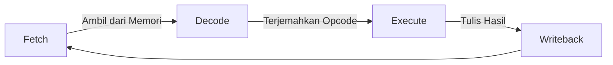

Ah, saya paham maksudmu! Kalau kamu cuma melihat *file* `.md` di mode pengetikan biasa (raw text) di VS Code, memang kelihatannya "jelek" karena penuh dengan simbol seperti `#`, `*`, `|`, dan `>`.

Keajaiban file `.md` (Markdown) baru akan terlihat kalau kamu mengaktifkan **Mode Preview** di VS Code.

Ikuti langkah ini persis supaya hasilnya langsung terlihat keren:

### Langkah 1: Copy Teks di Bawah Ini

*(Klik tombol "Copy" di pojok kanan atas kotak kode di bawah ini, lalu paste ke file `log-01-architecture.md` milikmu)*

```text
# ⚙️ Log 01: Dasar Arsitektur Komputer

> *"Reverse engineering bukan sekadar membaca kode, tapi memahami bagaimana prosesor 'berpikir' dan mengeksekusi instruksi di level paling dasar."*

---

## 🎯 Learning Objectives
- [ ] Memahami siklus **Fetch-Decode-Execute** sebagai jantung CPU.
- [ ] Mengenal register sebagai media penyimpanan super cepat.
- [ ] Membedah perbedaan arsitektur x86 dan x64 dalam konteks analisis.

---

## 🔄 The CPU Cycle (Siklus Eksekusi)
CPU tidak bekerja secara magis; ia mengikuti siklus instruksi yang sangat ketat:



---

## 🧠 Komponen Utama: Register

Register adalah "memori" internal CPU yang paling krusial. Saat kita melakukan *Reverse Engineering*, inilah tempat utama kita memantau data yang sedang diproses.

| Register | Nama Lengkap | Fungsi Utama |
| --- | --- | --- |
| **EAX/RAX** | Accumulator | Operasi Aritmatika & *Return Value* fungsi. |
| **ESP/RSP** | Stack Pointer | Menunjuk ke alamat puncak *Stack*. |
| **EBP/RBP** | Base Pointer | Referensi variabel lokal & argumen fungsi. |
| **EIP/RIP** | Instruction Pointer | Menunjuk ke alamat instruksi selanjutnya. |

---

## 🏗️ Stack vs Register

Bayangkan `Registers` adalah kantong celana kamu (sangat dekat & cepat), sedangkan `Stack` adalah tas ransel (menyimpan data dalam jumlah banyak untuk sementara waktu).

* **PUSH**: Memasukkan data ke tas (Stack).
* **POP**: Mengambil data dari tas (Stack).

---

## ⚠️ Professional Insight (Catatan Penting)

> **Waspada 64-bit!** Jika kamu melihat register diawali dengan huruf **'R'** (Contoh: `RAX`, `RSP`, `RIP`), berarti program tersebut berjalan di arsitektur **64-bit**.
> Jangan tertukar dengan **'E'** (seperti `EAX`), yang menandakan arsitektur **32-bit**. Salah mengenali ini akan membuat analisis kamu kacau balau!

---

### 💡 Key Takeaway

*Analisis arsitektur adalah langkah pertama. Sebelum masuk ke kode yang kompleks, pastikan kamu tahu CPU mana yang sedang 'berbicara' (32-bit atau 64-bit).*

---

*Status: ✅ Complete*

```

### Langkah 2: Cara Melihat "Tampilan Kerennya" di VS Code
Setelah kamu *paste* teks di atas ke VS Code, lakukan ini:

1. Di VS Code, tekan tombol **`Ctrl + Shift + V`** (di Windows) secara bersamaan.
2. Jendela baru akan terbuka di sebelah kanan yang menampilkan hasil *render* (visual asli) dari file Markdown tersebut. 
3. Di sinilah teks yang tadinya penuh simbol akan berubah menjadi tabel yang rapi, teks tebal, garis pembatas, dan blok kutipan yang elegan!

**Catatan Diagram:** Kalau diagram `mermaid` (yang ada gambar kotak dan panah siklus CPU) belum muncul gambarnya di VS Code, kamu tinggal install ekstensi bernama **"Markdown Preview Mermaid Support"** di VS Code kamu. Tapi jangan khawatir, saat kamu push ke **GitHub**, GitHub akan **otomatis** merender diagram tersebut dengan sangat rapi.

Coba di-*paste* dan tekan `Ctrl + Shift + V` sekarang. Kasih tahu saya kalau tampilannya sudah sesuai harapanmu!

```