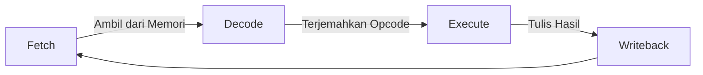

# ⚙️ Log 01: Dasar Arsitektur Komputer

> *"Reverse engineering bukan sekadar membaca kode, tapi memahami bagaimana prosesor 'berpikir' dan mengeksekusi instruksi di level paling dasar."*

---

## 🎯 Learning Objectives
- [ ] Memahami siklus **Fetch-Decode-Execute** sebagai jantung CPU.
- [ ] Mengenal register sebagai media penyimpanan super cepat.
- [ ] Membedah perbedaan arsitektur x86 dan x64 dalam konteks analisis.

---

## 🔄 The CPU Cycle (Siklus Eksekusi)
CPU tidak bekerja secara magis; ia mengikuti siklus instruksi yang sangat ketat:



---

## 🧠 Komponen Utama: Register

Register adalah "memori" internal CPU yang paling krusial. Saat kita melakukan *Reverse Engineering*, inilah tempat utama kita memantau data yang sedang diproses.

| Register | Nama Lengkap | Fungsi Utama |
| --- | --- | --- |
| **EAX/RAX** | Accumulator | Operasi Aritmatika & *Return Value* fungsi. |
| **ESP/RSP** | Stack Pointer | Menunjuk ke alamat puncak *Stack*. |
| **EBP/RBP** | Base Pointer | Referensi variabel lokal & argumen fungsi. |
| **EIP/RIP** | Instruction Pointer | Menunjuk ke alamat instruksi selanjutnya. |

---

## 🏗️ Stack vs Register

Bayangkan `Registers` adalah kantong celana kamu (sangat dekat & cepat), sedangkan `Stack` adalah tas ransel (menyimpan data dalam jumlah banyak untuk sementara waktu).

* **PUSH**: Memasukkan data ke tas (Stack).
* **POP**: Mengambil data dari tas (Stack).

---

## ⚠️ Professional Insight (Catatan Penting)

> **Waspada 64-bit!** Jika kamu melihat register diawali dengan huruf **'R'** (Contoh: `RAX`, `RSP`, `RIP`), berarti program tersebut berjalan di arsitektur **64-bit**.
> Jangan tertukar dengan **'E'** (seperti `EAX`), yang menandakan arsitektur **32-bit**. Salah mengenali ini akan membuat analisis kamu kacau balau!

---

### 💡 Key Takeaway

*Analisis arsitektur adalah langkah pertama. Sebelum masuk ke kode yang kompleks, pastikan kamu tahu CPU mana yang sedang 'berbicara' (32-bit atau 64-bit).*

---

*Status: ✅ Complete*

```
