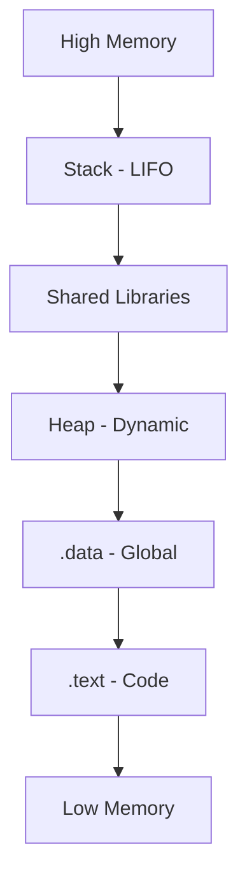

# 💾 Log 03: Memory Management

> *"Memahami bagaimana program mengalokasikan dan mengelola memori di sistem operasi."*

---

## 🎯 Learning Objectives
- [ ] Memahami perbedaan fungsi **Stack** vs **Heap**.
- [ ] Mengenal konsep *Virtual Memory* dan *Address Space*.
- [ ] Memahami *Buffer Overflow* sebagai celah keamanan utama.

---

## 🧠 Visualisasi Layout Memori
Setiap proses memiliki "ruang pribadi" di memori yang disebut **Virtual Address Space**.



---

## 📋 Perbandingan Stack vs Heap

| Fitur | Stack | Heap |
| --- | --- | --- |
| **Alokasi** | Otomatis (oleh CPU) | Manual (`malloc`/`new`) |
| **Ukuran** | Terbatas & Cepat | Sangat besar & Lambat |
| **Keamanan** | Sering jadi target *Exploit* | Berisiko *Memory Leak* |
| **Kecepatan** | Sangat Cepat | Lebih Lambat |

---

## 📝 Konsep Kunci

### 1. Stack (LIFO)

Tempat penyimpanan variabel lokal fungsi. Saat sebuah fungsi dipanggil, *Stack Frame* baru dibuat. Saat fungsi selesai, memori langsung dibersihkan.

> **Pro-Tip:** Jika kamu melihat `ESP` atau `RSP` terus berubah, itu tandanya program sedang aktif melakukan pemanggilan fungsi (*Function Calls*).

### 2. Heap (Dynamic)

Tempat data yang ukurannya tidak diketahui saat *compile time* disimpan. Memori di sini tidak otomatis dibersihkan oleh CPU, sehingga developer harus memanggil `free` atau `delete`.

### 3. Virtual Memory

Sistem operasi memberikan ilusi bahwa setiap aplikasi memiliki akses ke seluruh memori, padahal sebenarnya sistem operasi memetakan memori virtual tersebut ke **RAM fisik**.

---

## ⚠️ Professional Insight: Memory Security

> **The Danger Zone:** *Buffer Overflow* terjadi ketika program menulis data ke variabel di Stack tanpa memeriksa ukurannya. Akibatnya, data meluap dan menimpa *Return Address*. Inilah cara *attacker* mengendalikan alur program (EIP/RIP) untuk menjalankan kode berbahaya mereka.

---

### 💡 Key Takeaway

*Memahami memori adalah kunci dari 'Dynamic Analysis'. Saat kamu melakukan debugging, selalu pantau isi Stack untuk melihat parameter yang dikirim antar fungsi.*

---

*Status: ✅ Complete*

```

