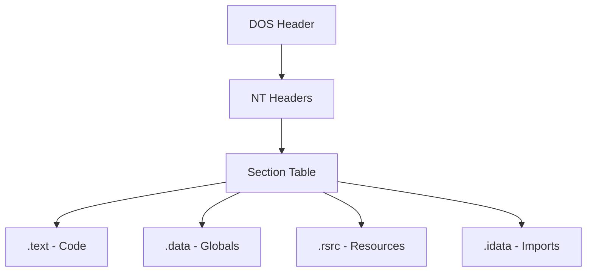

# 📂 Log 02: Struktur Portable Executable (PE)

> *"Anatomi sebuah file Windows: Memahami bagaimana sistem operasi memuat dan menjalankan program."*

---

## 🎯 Learning Objectives
- [ ] Memahami identitas dasar file PE (DOS Header & NT Headers).
- [ ] Menganalisis bagian-bagian utama (Sections) dalam file biner.
- [ ] Mengetahui pentingnya Entry Point dalam analisis statis.

---

## 🏗️ Struktur Hierarki PE
File .exe di Windows memiliki standar yang disebut Portable Executable (PE). Berikut adalah hierarkinya:



---

## 🧠 Komponen Kunci

### 1. DOS Header

Bagian awal file yang mengandung *Magic Number* "MZ" (0x4D 0x5A). Jika file tidak dimulai dengan "MZ", file tersebut bukanlah file executable Windows yang valid.

### 2. NT Headers (PE Header)

Bagian terpenting bagi analis keamanan. Di sini terdapat:

* **Signature**: "PE\0\0".
* **Entry Point**: Alamat memori di mana instruksi pertama program dijalankan.

### 3. Sections

File dipecah menjadi beberapa "ruang" dengan fungsi berbeda:

| Section | Fungsi |
| --- | --- |
| **.text** | Berisi instruksi Assembly yang dijalankan CPU. |
| **.data** | Variabel global yang diinisialisasi. |
| **.rsrc** | Resources (Ikon, gambar, teks, atau manifest). |
| **.idata** | Import Table (Daftar fungsi dari DLL yang dipanggil). |

---

## ⚠️ Professional Insight

> **Waspada Section yang Mencurigakan!**
> Dalam analisis malware, perhatikan nama section. Jika kamu menemukan section dengan nama tidak umum seperti "UPX0", "UPX1", atau "ASPack", itu indikator kuat bahwa file tersebut telah di-Pack atau dikompresi untuk menyembunyikan kode aslinya.

---

### 💡 Key Takeaway

*Struktur PE adalah peta jalan kamu. Sebelum melakukan debugging, selalu buka header file untuk mengetahui di mana Entry Point-nya. Jika kamu tahu di mana program dimulai, kamu tahu di mana harus menaruh Breakpoint pertama kamu.*

---

*Status: ✅ Complete*

```
