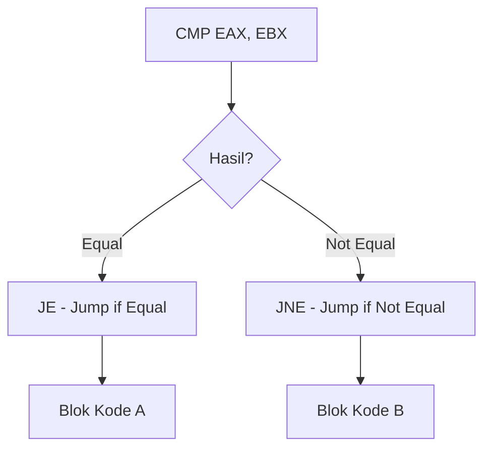

# 📜 Log 04: Basic Assembly (x86/x64)

> *"Bahasa ibu mesin: Berbicara langsung dengan CPU tanpa perantara."*

---

## 🎯 Learning Objectives
- [ ] Memahami kategori instruksi dasar (Data Transfer, Arithmetic, Control Flow).
- [ ] Mampu membaca alur logika `if-else` dalam Assembly.
- [ ] Mengenal instruksi krusial yang sering muncul di Malware/Software.

---

## 🔄 Alur Logika Assembly
Assembly menggunakan teknik "lompatan" (Jumping) untuk mengelola alur logika, tidak seperti bahasa tinggi yang menggunakan `if` atau `while`.



---

## 🛠 Tabel Instruksi Paling Penting

| Kategori | Instruksi | Deskripsi |
| --- | --- | --- |
| **Data Transfer** | `MOV` | Menyalin data (Dest, Src). |
|  | `PUSH/POP` | Memasukkan/Mengambil data dari Stack. |
| **Arithmetic** | `ADD/SUB` | Penjumlahan/Pengurangan. |
|  | `INC/DEC` | Menambah/Mengurangi 1 (Increment/Decrement). |
| **Control Flow** | `CMP` | Membandingkan dua nilai. |
|  | `JMP` | Lompatan tak bersyarat (Unconditional). |
|  | `JE / JNE` | Lompat jika Equal / Not Equal. |

---

## 🧠 Analisis Logika (The "IF" Logic)

Dalam pemrograman tinggi, kita menulis: `if (x == y)`.
Dalam Assembly, prosesnya adalah:

1. `CMP EAX, EBX` : CPU membandingkan `EAX` dan `EBX`.
2. `JE  target_label` : Jika sama, lompat ke `target_label`.
3. `...` : Jika tidak, jalankan baris berikutnya.

> **Pro-Tip:** Perhatikan instruksi `CMP` diikuti `JE` atau `JNZ` (Jump Not Zero). Ini adalah **90%** dari logika validasi password atau lisensi software!

---

## ⚠️ Professional Insight: Calling Functions

> **The Call Pattern:** Setiap kali kamu melihat `CALL [alamat]`, itu berarti program sedang memanggil sebuah fungsi (seperti fungsi API Windows atau fungsi logika sendiri).
> * Sebelum `CALL`, biasanya ada `PUSH` (untuk mengirim argumen).
> * Setelah `CALL`, ada `ADD ESP, X` (untuk membersihkan Stack).
> 
> 

---

### 💡 Key Takeaway

*Assembly itu tentang 'Memindahkan' dan 'Membandingkan'. Jika kamu bisa mengikuti aliran instruksi `MOV` dan `JMP`, kamu bisa membedah hampir semua logika program yang disembunyikan.*

---

*Status: ✅ Complete*

```

---
