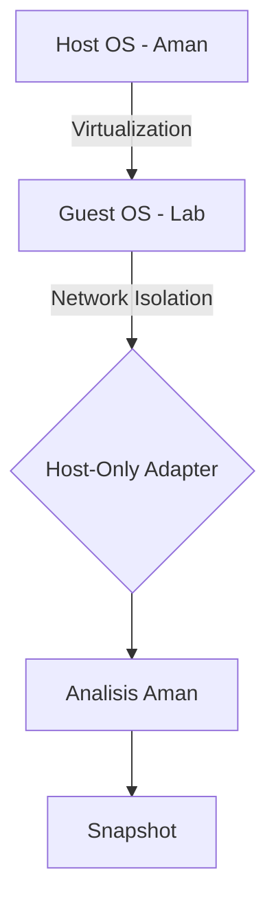

# 🛡️ Log 05: Lab Setup & Isolation

> *"Keamanan adalah prioritas utama. Jangan pernah menganalisis 'binatang buas' tanpa kandang yang kuat."*

---

## 🎯 Learning Objectives
- [ ] Membangun lingkungan analisis yang terisolasi (*Sandbox*).
- [ ] Memahami pentingnya *Snapshotting* sebagai fitur pemulihan.
- [ ] Mengatur jaringan agar aman dari akses internet luar.

---

## 🏗️ Strategi Isolasi Lab
Analisis malware atau file berbahaya tidak boleh dilakukan di *Host OS*. Kita harus menciptakan "dunia terpisah" di dalam Virtual Machine (VM).



---

## 📋 Checklist Persiapan Lab

### 1. Virtualization Software

Gunakan **VMware Workstation** atau **VirtualBox**. Keduanya memungkinkan pembuatan *Snapshot* (titik balik) untuk memulihkan sistem ke kondisi semula dalam hitungan detik.

### 2. Network Isolation (PENTING!)

* **Host-Only Adapter**: Mode ini memutuskan akses internet VM ke dunia luar, namun VM masih bisa berkomunikasi dengan Host (jika diperlukan).
* **Disabled Shared Folders**: Matikan fitur *Shared Folder* untuk mencegah malware berpindah dari VM ke Host.

### 3. Snapshot Workflow

1. **Clean Install**: Instal Windows/Linux di VM.
2. **Tools Install**: Instal semua *Reverse Engineering tools* (x64dbg, Ghidra, DiE).
3. **Create Snapshot**: Ambil *snapshot* pertama ("Clean Baseline").
4. **Analysis**: Lakukan analisis.
5. **Restore**: Balikkan ke *snapshot* "Clean Baseline" setelah selesai.

---

## 🧠 Konsep Keamanan Analisis

* **Snapshotting**: Fitur penyelamat. Kamu bisa bereksperimen sebrutal apa pun dan kembali ke keadaan semula hanya dengan satu klik.
* **Minimalist Environment**: Jangan menginstal aplikasi pribadi (browser, email, dsb) di VM analisis agar tidak ada data sensitif yang berisiko.

---

## ⚠️ Professional Insight: The Golden Rule

> **"Jangan Pernah Mengabaikan Internet!"**
> Beberapa malware melakukan *Check-out* ke server C2 (Command & Control) segera setelah dijalankan. Jika VM kamu tersambung ke internet, malware tersebut mungkin bisa mendownload *payload* tambahan atau memperbarui dirinya. **Selalu gunakan Host-Only atau putus koneksi saat analisis dinamis.**

---

### 💡 Key Takeaway

*Lab adalah ruang kerja utama peneliti. Jika lab kamu berantakan atau tidak aman, hasil analisis kamu tidak bisa dipercaya. Buatlah sistem 'Clean Baseline' agar setiap analisis dimulai dari titik nol yang bersih.*

---

*Status: ✅ Complete*

```

