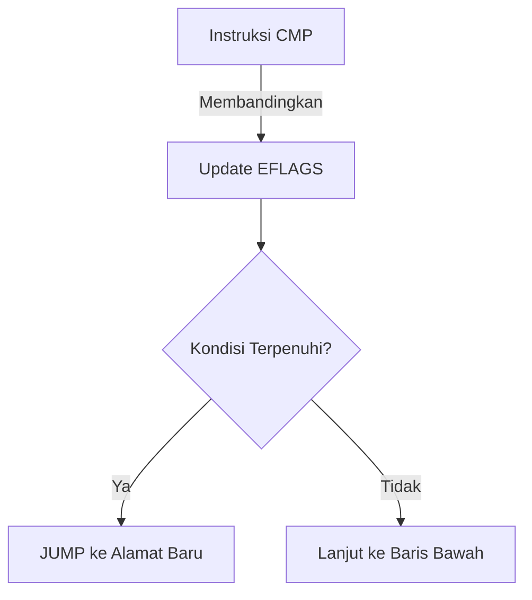

# 📜 Log 06: Assembly Cheat Sheet

> *"Referensi cepat instruksi dasar untuk membedah logika biner dalam sekejap."*

---

## 🎯 Learning Objectives
- [ ] Memiliki panduan cepat instruksi Assembly x86/x64.
- [ ] Memahami pola logika dasar dalam kode biner.
- [ ] Mempercepat proses analisis tanpa harus membuka manual tebal.

---

## 🏗️ Cheat Sheet: Instruksi Utama

### 1. Data Transfer (Perpindahan Data)
| Mnemonic | Operasi | Penjelasan |
| :--- | :--- | :--- |
| `MOV Dest, Src` | `Dest = Src` | Menyalin nilai dari sumber ke tujuan. |
| `PUSH Reg` | `[ESP] = Reg` | Menyimpan data ke Stack. |
| `POP Reg` | `Reg = [ESP]` | Mengambil data dari Stack. |
| `LEA Reg, [Addr]` | `Reg = Addr` | Mengambil alamat memori (bukan isinya). |

### 2. Arithmetic & Logic
| Mnemonic | Operasi | Penjelasan |
| :--- | :--- | :--- |
| `ADD Dest, Src` | `Dest += Src` | Penjumlahan. |
| `SUB Dest, Src` | `Dest -= Src` | Pengurangan. |
| `INC / DEC` | `Reg++ / Reg--` | Increment / Decrement. |
| `XOR A, A` | `A = 0` | Teknik umum untuk mengosongkan register. |

### 3. Control Flow (Logika Program)
| Mnemonic | Kondisi | Penjelasan |
| :--- | :--- | :--- |
| `CMP A, B` | `A - B` | Membandingkan dua nilai (set EFLAGS). |
| `JMP Addr` | Selalu | Lompatan tak bersyarat. |
| `JE / JZ` | Equal / Zero | Lompat jika sama / hasil nol. |
| `JNE / JNZ` | Not Equal / Not Zero | Lompat jika tidak sama / tidak nol. |
| `CALL Addr` | - | Memanggil fungsi (masuk ke dalam fungsi). |
| `RET` | - | Keluar dari fungsi kembali ke Caller. |

---

## 🧠 Pola Logika yang Sering Ditemui



---

## ⚠️ Professional Insight: The "XOR" Trick

> **Kenapa sering melihat `XOR EAX, EAX`?**
> Dalam Assembly, ini adalah cara tercepat dan paling efisien untuk membuat nilai `EAX` menjadi `0`. Kompilator sering menggunakan ini daripada `MOV EAX, 0` karena instruksinya lebih pendek dalam kode biner.

---

### 💡 Key Takeaway

*Jangan menghafal semua, hafalkan POLANYA. Kamu akan sering melihat `CMP` diikuti `JNZ`. Itu adalah tanda ada logika pengecekan (seperti login atau lisensi). Jika kamu ingin melewati pengecekan tersebut, kamu tinggal mengubah `JNZ` (Jump Not Zero) menjadi `NOP` (No Operation) atau `JMP`.*

---

*Status: ✅ Phase 01 Complete*

```

---
