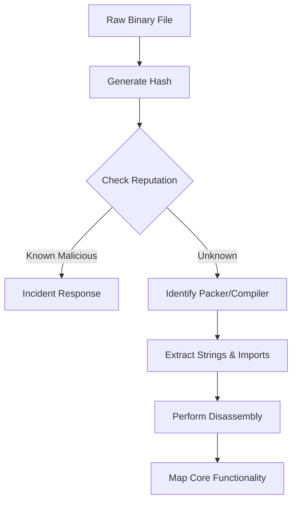

# 🔍 Phase 02: Static Inspection

> *"Melihat sebelum melangkah. Fase ini adalah tentang pengumpulan informasi tanpa mengeksekusi biner, meminimalkan risiko, dan membangun pemahaman logika sebelum masuk ke arena debugging."*

---

## 📊 Phase Overview
Di fase ini, kita beralih dari fondasi teoritis ke tindakan nyata. Kita akan mempelajari teknik *Triage* untuk memahami kapabilitas sebuah file biner hanya dengan melihat jejak digital yang ditinggalkannya. Fokus utama adalah mendapatkan gambaran besar mengenai fungsi, maksud, dan keamanan sebuah file sebelum menyentuh sistem operasi.

## 🗺️ Learning Roadmap
| Log | Topik Utama | Deskripsi Mendalam |
| :--- | :--- | :--- |
| **01** | **Disassembly Basics** | Membedah peran Disassembler (Ghidra/IDA) dalam mengubah biner menjadi kode assembly dan pseudocode yang bisa dibaca. |
| **02** | **Imports & Strings** | Analisis kapabilitas via API Calls dan pencarian petunjuk (IP, URL, Pesan Error) yang tertanam dalam file. |
| **03** | **Hash Analysis** | Penggunaan sidik jari digital untuk identifikasi cepat dan pengecekan reputasi melalui database global seperti VirusTotal. |
| **04** | **Packer Detection** | Deteksi biner yang disembunyikan menggunakan wrapper/packer (seperti UPX) dan identifikasi anomali pada section file. |

---

## 🧠 Core Methodology (The Static Triage Flow)
Sebelum melakukan analisis mendalam, ikuti *Static Triage Flow* berikut untuk menghemat waktu:



---

## 🛠 Pro-Tips for Static Analysis

1. **Don't Run It!**: Ingat, tujuan utama fase ini adalah **Zero Execution**. Jangan pernah menjalankan file yang belum kamu pahami perilakunya.
2. **Look for the 'Why'**: Saat melihat *Imports*, jangan hanya mencatat fungsinya, tanyakan: "Mengapa aplikasi ini butuh fungsi jaringan (`ws2_32.dll`) jika fungsinya adalah kalkulator?"
3. **Cross-Reference**: Selalu bandingkan hasil string dengan struktur API yang diimpor. Jika keduanya cocok, kamu telah berhasil memprofilkan program tersebut.
4. **Tooling Consistency**: Biasakan diri dengan satu atau dua alat saja (misal: **Ghidra** dan **Detect It Easy**) agar pemahamanmu terhadap alur kerja biner menjadi insting.

---

## 💡 Professional Mindset

> "Seorang analis yang baik adalah dia yang bisa menceritakan apa yang dilakukan sebuah program hanya dengan melihat struktur biner-nya. Disassembly bukanlah tentang menghafal instruksi, tapi tentang mengenali **pola**."

---

## 🚀 Status

* **Log 01-04**: Completed.
* **Goal**: Membangun kemampuan *Static Triage* yang efisien.
* **Next Phase**: [Phase 03: Dynamic Analysis] — *Bersiaplah untuk melihat program 'beraksi' dalam lingkungan yang terkontrol.*

---

*Status: 🛡️ Phase 02 Static Inspection Complete.*

```

---
