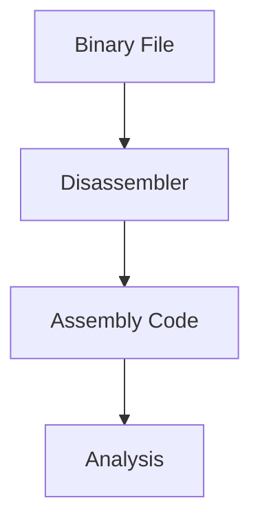

# 🔍 Log 01: Disassembly Basics

> *"Melihat isi 'jeroan' program: Mengubah biner yang tidak terbaca menjadi kode Assembly yang bisa kita pahami."*

---

## 🎯 Learning Objectives
- [ ] Memahami konsep dasar Disassembly.
- [ ] Mengenal peran Disassembler dalam membedah biner.
- [ ] Mampu membedakan kode instruksi (Assembly) dan data.

---

## 🏗️ The Disassembly Workflow

---

## 🧠 Konsep Penting

### 1. Apa itu Disassembly?

Disassembly adalah proses menerjemahkan file biner (machine code) kembali ke bahasa Assembly. Karena komputer hanya memahami angka biner (`0` dan `1`), kita memerlukan *disassembler* untuk mengubah angka tersebut menjadi instruksi yang bisa dibaca manusia seperti `MOV`, `PUSH`, `CMP`, dan `JMP`.

### 2. Disassembler vs Decompiler

* **Disassembler**: Menampilkan instruksi *Assembly* (bahasa tingkat rendah). Sangat akurat namun sulit dibaca.
* **Decompiler**: Berusaha mengubah biner langsung menjadi bahasa tingkat tinggi (seperti C/C++). Lebih mudah dibaca, namun sering kali tidak akurat dalam merekonstruksi logika asli program.

### 3. Komponen Utama

* **Opcode**: Kode operasi yang memberi tahu CPU apa yang harus dilakukan.
* **Operand**: Data atau alamat memori yang diproses oleh opcode.

---

## ⚠️ Professional Insight

> **Ingat:** Disassembly adalah representasi statis. Ia tidak menunjukkan apa yang sebenarnya terjadi saat program berjalan, hanya menunjukkan apa yang "bisa" dilakukan oleh program tersebut. Untuk memahami alur eksekusi yang kompleks, kita nantinya akan membutuhkan *Dynamic Debugging*.

---

## 💡 Key Takeaway

*Disassembly adalah gerbang pertama dalam reverse engineering. Sebelum mencoba menjalankan atau memodifikasi program, kamu harus bisa membaca instruksi dasar yang ada di dalamnya.*

---

*Status: 🔍 Phase 02 - Log 01 Disassembly Basics Complete.*

