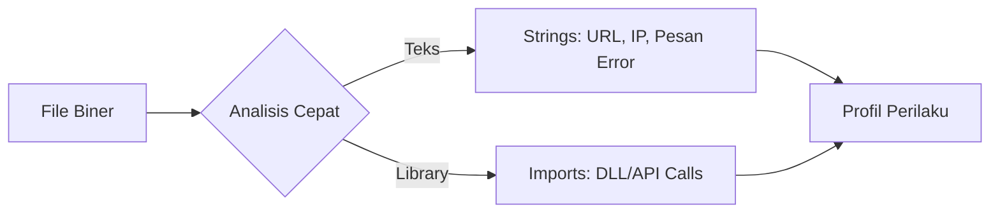

# 🔍 Log 02: Imports & Strings Analysis

> *"Jangan tertipu oleh antarmuka. Daftar fungsi dan string yang tertanam adalah jejak digital yang tidak bisa disembunyikan oleh sebuah program."*

---

## 🎯 Learning Objectives
- [ ] Memahami peran `Import Table` dalam mengidentifikasi kapabilitas program.
- [ ] Menganalisis `Strings` untuk menemukan petunjuk logika atau indikator serangan.
- [ ] Mengaitkan fungsi API dengan perilaku sistem yang mungkin terjadi.

---

## 🏗️ Mengapa Imports & Strings Penting?
Sebelum masuk ke *disassembly* yang rumit, kita melakukan *Triage* (penilaian cepat). Dengan melihat daftar fungsi yang diimpor, kita bisa langsung menebak apa yang dilakukan program tersebut.



---

## 🧠 Komponen Analisis

### 1. Imports (The Capabilities)

Program Windows jarang melakukan semuanya sendiri. Mereka memanggil API dari `DLL` sistem.

* **`ws2_32.dll`**: Berisi fungsi jaringan. Jika ada, program kemungkinan besar berkomunikasi dengan internet.
* **`kernel32.dll`**: Operasi dasar sistem, akses file, dan manajemen memori.
* **`advapi32.dll`**: Sering digunakan untuk manipulasi *Registry* atau layanan Windows.

### 2. Strings (The Clues)

Teks yang tersimpan di dalam biner adalah "harta karun". Cari hal-hal berikut:

* **URL / IP Address**: Indikator server C2 (Command & Control).
* **Nama File / Path**: Lokasi di mana program akan menulis data.
* **Pesan Kesalahan**: Petunjuk logika validasi (misal: "Invalid License Key", "Access Denied").

---

## ⚠️ Professional Insight: The "Hidden" Strings

> **Hati-hati dengan Obfuscation!**
> Malware profesional sering tidak menyimpan string dalam bentuk teks biasa. Mereka menggunakan teknik **Encoding** (seperti Base64) atau **Encryption** (seperti XOR) agar string tidak bisa ditemukan dengan alat *strings* biasa. Jika kamu melihat banyak data acak di *Import Table* atau string yang tidak terbaca, curigalah ada teknik *obfuscation* di sana.

---

## 💡 Key Takeaway

*Analisis Imports dan Strings adalah langkah pertama yang paling efisien. Jangan habiskan waktu berjam-jam melakukan debugging jika jawabannya ada pada string yang bisa dibaca dalam hitungan detik.*

---

*Status: ✅ Phase 02 - Log 02 Complete*

```

---

### Tips Analisis untuk Log 02:
1.  **Tools:** Gunakan `PEview`, `Dependencies`, atau langsung dari `Ghidra` untuk melihat *Import Table*. Untuk mencari *Strings*, kamu bisa menggunakan alat sederhana bernama `Strings` dari Sysinternals atau fitur *Strings* di `Ghidra`.
2.  **Koneksi:** Jika sebuah file mengimpor `InternetOpenA` atau `HttpSendRequestA` dari `wininet.dll`, kamu sudah tahu 100% bahwa file tersebut melakukan aktivitas jaringan.


```