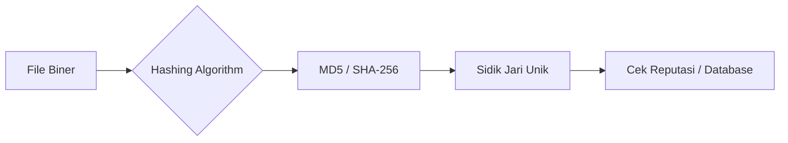

# 🆔 Log 03: Hash Analysis

> *"Satu file, satu sidik jari. Hash adalah cara tercepat untuk mengenali 'siapa' file ini di dunia digital."*

---

## 🎯 Learning Objectives
- [ ] Memahami fungsi Hash sebagai sidik jari unik file.
- [ ] Menggunakan Hash untuk verifikasi integritas data.
- [ ] Memanfaatkan VirusTotal untuk analisis cepat berbasis reputasi.

---

## 🏗️ Mengapa Hash Itu Penting?
Jika satu bit saja diubah dalam file, hasil *hash*-nya akan berubah drastis. Ini menjadikannya alat verifikasi integritas yang mutlak.



---

## 🧠 Konsep Utama

### 1. Algoritma Hash Populer

* **MD5**: Cepat, tapi sudah dianggap tidak aman untuk kriptografi (karena *collision*), namun masih sangat umum digunakan untuk penamaan cepat.
* **SHA-256**: Standar industri saat ini. Sangat aman dan hampir mustahil untuk dipalsukan (konsep *collision resistance*).

### 2. Hash sebagai "Indicator of Compromise" (IoC)

Dalam dunia keamanan, saat kita menemukan file berbahaya, kita tidak membagikan file tersebut (karena bahaya), melainkan kita membagikan **Hash-nya**. Peneliti lain bisa mencocokkan hash tersebut dengan database mereka.

### 3. Reputasi di VirusTotal

Hash memungkinkan kita untuk melakukan *query* ke database global seperti VirusTotal. Jika hash sudah ada di database mereka, kita bisa melihat:

* Berapa banyak vendor antivirus yang mendeteksinya.
* Kapan file ini pertama kali terlihat (*First seen*).
* Analisis perilaku dari peneliti lain.

---

## ⚠️ Professional Insight: Hash vs Content

> **Hati-hati dengan Modifikasi!**
> Ingat, *hashing* hanya memberi tahu kamu apakah file tersebut "identik" atau tidak. Jika malware dimodifikasi sedikit saja (misalnya mengubah satu byte instruksi), hash-nya akan berubah total. Jangan pernah mengandalkan hash sebagai satu-satunya cara deteksi. Selalu gabungkan dengan **Behavioral Analysis** (Fase 03).

---

## 💡 Key Takeaway

*Hash adalah langkah pertama dalam 'Triage'. Sebelum membuka disassembler, selalu ambil hash-nya dan cek ke database (seperti VirusTotal atau Hybrid Analysis). Jika file sudah dikenal berbahaya, kamu bisa menghemat waktu berjam-jam!*

---

*Status: ✅ Phase 02 - Log 03 Complete*

```

---

### Tips untuk Log 03:
1.  **Praktik:** Coba buka terminal (CMD atau PowerShell) dan ketik `CertUtil -hashfile "namafile.exe" SHA256`. Ini adalah cara tercepat di Windows untuk mendapatkan sidik jari file.
2.  **Keamanan:** Jika kamu mendapatkan file baru, ambil hash-nya dulu sebelum melakukan apa pun. Itu adalah SOP (Standard Operating Procedure) wajib seorang peneliti.


```