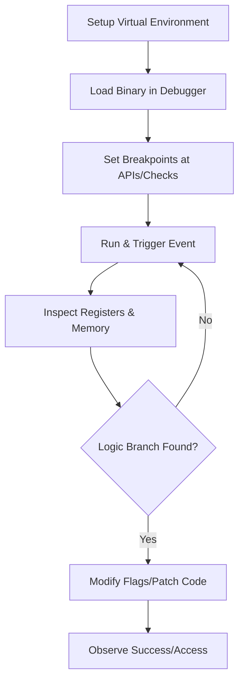

# ⚡ Phase 03: Dynamic Debugging

> *"Observasi adalah kunci, tetapi intervensi adalah kendali. Fase ini membawa kita dari pengamat menjadi pengendali alur eksekusi sebuah program."*

---

## 📊 Phase Overview
Di fase ini, kita beralih ke analisis *runtime*. Kita tidak lagi hanya melihat kode statis, melainkan menjalankan program di lingkungan yang terkontrol untuk melihat bagaimana ia berperilaku, bagaimana ia memproses memori, dan bagaimana ia merespons input kita. Ini adalah inti dari kegiatan *reverse engineering* dan *crackme solving*.

## 🗺️ Learning Roadmap
| Log | Topik Utama | Deskripsi Mendalam |
| :--- | :--- | :--- |
| **01** | **Breakpoint Basics** | Menguasai penggunaan *Software*, *Hardware*, dan *Conditional Breakpoint* untuk menghentikan eksekusi di titik krusial. |
| **02** | **Register Analysis** | Memantau `EAX`, `ESP`, `EIP` untuk memahami bagaimana data diproses di "otak" CPU secara real-time. |
| **03** | **Memory Inspection** | Membaca *Hex Dump* dan *Memory Map* untuk menemukan rahasia yang tersimpan dalam *Stack* maupun *Heap*. |
| **04** | **Execution Tracing** | Manipulasi alur logika melalui *Flags* (`ZF`, `CF`) dan teknik *Patching* instruksi `JMP`/`JCC`. |

---

## 🧠 Core Methodology (The Dynamic Debugging Flow)
Saat melakukan analisis dinamis, ikuti alur metodis untuk memastikan keamanan dan efisiensi:



---

## 🛠 Professional Debugging Workflow

1. **Safety First**: Selalu lakukan debugging di dalam Virtual Machine (VM) yang terisolasi.
2. **Follow the Data**: Jangan terpaku pada kode yang panjang. Gunakan fitur *"Follow in Dump"* pada register untuk melacak ke mana input pengguna pergi.
3. **The Patching Mindset**: Dalam tugas *crackme*, tujuan kita seringkali bukan memecahkan algoritma enkripsi, melainkan memodifikasi instruksi percabangan (`Jump`) agar program mengikuti alur yang kita inginkan.
4. **Documentation**: Setiap manipulasi (patching) harus dicatat alamat memorinya (Offset) agar bisa diulang atau dilaporkan dengan akurat.

---

## 💡 Professional Mindset

> "Debugger adalah mikroskop terbaik. Jika kamu tidak paham apa yang dilakukan sebuah fungsi secara statis, jalankan programnya, pasang breakpoint, dan lihat perubahan nilai di register saat fungsi tersebut selesai dijalankan."

---

## 🚀 Status

* **Log 01-04**: Completed.
* **Goal**: Membangun kemampuan analisis dinamis untuk memecahkan proteksi biner.
* **Next Phase**: [Phase 04: Advanced Topics] — *Membahas Anti-Debugging dan teknik bypass tingkat lanjut.*

---

*Status: ⚡ Phase 03 Dynamic Debugging Complete.*

```

---


```