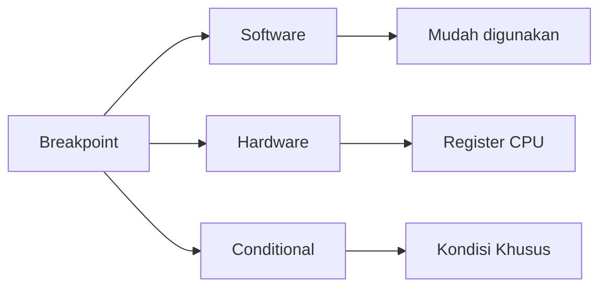

# 🛑 Log 01: Mastering Breakpoints

> *"Breakpoint bukan sekadar 'berhenti', ini adalah teknik untuk menangkap alur eksekusi di titik yang paling krusial."*

---

## 🎯 Learning Objectives
- [ ] Memahami perbedaan jenis Breakpoint dalam analisis dinamis.
- [ ] Menentukan kapan harus menggunakan Software vs Hardware Breakpoint.
- [ ] Menguasai teknik Conditional Breakpoint untuk efisiensi analisis.

---

## 🏗️ Jenis Breakpoint dalam x64dbg



---

## 🧠 Teknik Analisis Breakpoint

### 1. Software Breakpoint (F2)

* **Mekanisme**: Debugger menimpa instruksi asli dengan opcode khusus.
* **Kelebihan**: Tidak terbatas jumlahnya.
* **Kekurangan**: Terdeteksi oleh aplikasi yang memiliki proteksi anti-debugging.

### 2. Hardware Breakpoint

* **Mekanisme**: Menggunakan register debug CPU.
* **Kelebihan**: Tidak mengubah kode asli. Sangat efektif untuk memantau akses memori.
* **Kekurangan**: Terbatas (CPU biasanya hanya menyediakan 4 slot).

### 3. Conditional Breakpoint (Shift+F2)

* **Skenario**: Berhenti hanya jika suatu register memiliki nilai tertentu.
* **Penerapan**: Sangat ampuh saat mencari password atau serial key tanpa harus melakukan proses manual berulang kali.

---

## ⚠️ Professional Insight: Breakpoint Placement

> **Strategi Penempatan**:
> Jangan memasang breakpoint sembarangan. Selalu cari API Calls yang relevan. Pasang breakpoint di sana, dan kamu akan langsung berada di jantung logika program tersebut.

---

## 💡 Key Takeaway

*Breakpoint adalah navigasi kamu di lautan kode. Kuasai penggunaan Hardware Breakpoint untuk target dengan proteksi, dan gunakan Conditional Breakpoint untuk mempercepat proses pencarian kunci.*

---

*Status: ⚡ Phase 03 - Log 01 Breakpoints Complete.*

```

