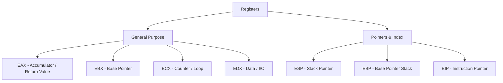

# 🗄️ Log 02: Register Analysis

> *"Register adalah otak dari eksekusi: Membaca register berarti membaca pikiran CPU di setiap detiknya."*

---

## 🎯 Learning Objectives
- [ ] Mengenal fungsi utama register General Purpose (GPRs).
- [ ] Memahami peran register khusus seperti `EIP` dan `ESP`.
- [ ] Melakukan tracking nilai data selama eksekusi program.

---

## 🏗️ Anatomi Register (x86 Architecture)

Register adalah lokasi penyimpanan super cepat yang ada di dalam CPU. Berikut adalah register yang paling sering kamu pantau di debugger:



---

## 🧠 Analisis Register saat Debugging

### 1. General Purpose Registers (GPRs)

* **EAX**: Sering menyimpan hasil *return* dari sebuah fungsi. Jika fungsi membandingkan password, hasil `1` (True) atau `0` (False) biasanya ada di sini.
* **ECX**: Sering digunakan sebagai *counter* dalam operasi `LOOP` atau saat memindahkan data dalam jumlah besar (`REP` prefix).

### 2. Pointer & Control Registers (Sangat Krusial!)

* **ESP (Stack Pointer)**: Selalu menunjuk ke puncak *Stack*. Jika kamu ingin tahu data apa yang baru saja di-*push* ke dalam memori, intip alamat yang ditunjuk oleh `ESP`.
* **EIP (Instruction Pointer)**: Ini adalah "mata" CPU. Alamat yang tertulis di `EIP` adalah instruksi **berikutnya** yang akan dijalankan. Jika program *crash* atau *hang*, periksa nilai `EIP` untuk melihat di mana program "tersesat".

---

## ⚠️ Professional Insight: The "EAX" Trap

> **Return Value Analysis**:
> Dalam banyak kasus *cracking*, setelah memanggil fungsi validasi password (seperti `checkPassword()`), segera periksa nilai `EAX`. Jika `EAX` bernilai `0` setelah fungsi tersebut, besar kemungkinan validasi gagal. Kamu bisa mencoba mengubah nilai `EAX` secara manual di debugger menjadi `1` untuk melihat apakah program "tertipu" dan menganggap password benar.

---

## 💡 Key Takeaway

*Jangan hanya membaca baris Assembly, monitor pergerakan datanya melalui register. Seringkali, kamu tidak perlu memahami seluruh fungsi kompleks; cukup perhatikan apa yang dimasukkan ke register sebelum fungsi dipanggil dan apa yang keluar dari `EAX` setelah fungsi selesai.*

---

*Status: ⚡ Phase 03 - Log 02 Register Analysis Complete.*

```

---

### Tips Praktik untuk Log 02:
1.  **Observasi:** Saat melakukan *Step Into* (`F7`) atau *Step Over* (`F8`) di x64dbg, perhatikan kolom **Registers** di panel sebelah kanan. Kamu akan melihat nilai-nilai di dalamnya berubah warna menjadi **merah** setiap kali ada data yang diperbarui.
2.  **Manipulation:** Di x64dbg, kamu bisa klik dua kali pada nilai register (misal pada `EAX`) dan mengubah angkanya secara langsung. Ini adalah teknik dasar untuk melakukan *hot-patching* logika program saat *runtime*.


```