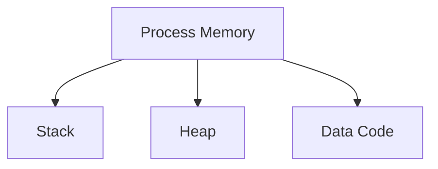

# 💾 Log 03: Memory Inspection

> *"Jika kode adalah instruksinya, maka memori adalah perpustakaan datanya. Temukan di mana program menyimpan rahasianya."*

---

## 🎯 Learning Objectives
- [ ] Memahami organisasi memori dalam proses.
- [ ] Mampu membaca dan menafsirkan data di Hex Dump.
- [ ] Menggunakan Memory Map untuk identifikasi akses memori.

---

## 🏗️ Struktur Memori Proses

---

## 🧠 Teknik Inspeksi Memori

### 1. Hex Dump

Panel ini menampilkan data dalam format Hexadecimal dan ASCII.

* **Pencarian**: Gunakan ini untuk mencari string atau flag yang tersimpan di memori.
* **Endianness**: Ingat bahwa data pada sistem x86 biasanya tersimpan dalam format Little-Endian.

### 2. Stack vs Heap

* **Stack**: Menyimpan variabel lokal dan alamat kembali. Sering menjadi target analisis keamanan.
* **Heap**: Digunakan untuk alokasi memori dinamis. Data input pengguna sering berakhir di sini.

### 3. Memory Map

Gunakan fitur Memory Map untuk melihat izin setiap segmen memori:

* R (Read): Hanya bisa dibaca.
* W (Write): Bisa diubah.
* X (Execute): Berisi kode yang bisa dijalankan.

---

## ⚠️ Professional Insight

> **Tips Mencari Flag:**
> Saat memasukkan input ke program, gunakan fitur "Follow in Dump" pada alamat memori yang ditunjuk register. Seringkali, input-mu terlihat jelas di memori sebelum fungsi perbandingan dijalankan.

---

## 💡 Key Takeaway

*Jika sebuah program melakukan enkripsi pada kunci, jangan mencoba memecahkan algoritmanya. Tunggu sampai program mendekripsi kunci tersebut di memori, lalu intip langsung di sana.*

---

*Status: ⚡ Phase 03 - Log 03 Memory Inspection Complete.*

