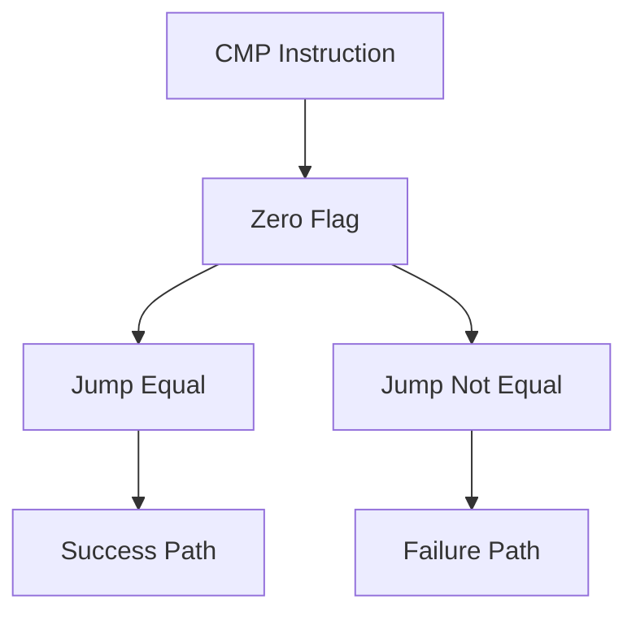

# 👣 Log 04: Execution Tracing & Flow Control

> *"Mengendalikan takdir program: Jika pintu tertutup, kita tidak perlu membongkarnya, kita cukup mengubah instruksi yang menguncinya."*

---

## 🎯 Learning Objectives
- [ ] Memahami peran instruksi Jump.
- [ ] Menguasai teknik manipulasi flag untuk mengubah alur logika.
- [ ] Melakukan Patching instruksi secara dinamis.

---

## 🏗️ Mekanisme Jumps

---

## 🧠 Teknik Manipulasi Alur

### 1. The Power of Flags

* **ZF (Zero Flag)**: Flag paling penting dalam crack. Jika perbandingan dua nilai sama, ZF bernilai 1.
* **Manipulasi**: Kamu bisa memaksa ZF menjadi 1 atau 0 di debugger untuk menentukan apakah program akan melompat atau tidak.

### 2. Patching Instructions

Jika kamu menemukan instruksi yang menghalangi akses, gunakan teknik ini:

* **NOP (No Operation)**: Mengubah instruksi menjadi 90 (hex). Program akan melewati baris tersebut tanpa melakukan apa-apa.
* **Forced Jump**: Mengubah instruksi agar selalu melompat ke alur sukses.

### 3. Tracing

Gunakan fitur Run Trace untuk merekam jejak instruksi yang dilewati program agar bisa dianalisis kembali langkah demi langkah.

---

## ⚠️ Professional Insight

> **Jangan Merusak Struktur!**
> Saat melakukan patching, pastikan ukuran instruksi yang kamu ganti sama dengan instruksi baru agar program tidak crash.

---

## 💡 Key Takeaway

*Dengan memahami EFLAGS dan cara memodifikasi instruksi Jump, kamu memiliki kendali penuh atas program. Kamu tidak perlu memecahkan enkripsi jika kamu bisa memaksakan program melewati fungsi validasi tersebut.*

---

*Status: ⚡ Phase 03 - Log 04 Execution Tracing Complete.*
