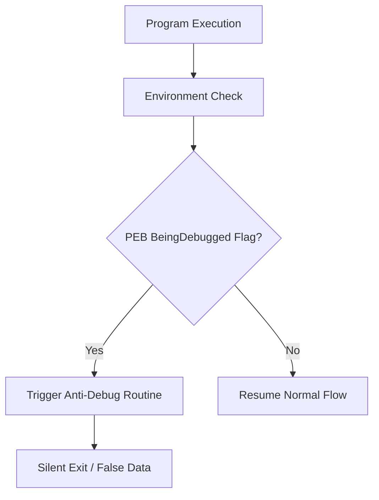

# 🛡️ Log 01: Anti-Debugging Techniques (Advanced)

> *"Deep dive ke dalam mekanisme pertahanan biner: Bagaimana aplikasi mendeteksi campur tangan debugger."*

---

## 🎯 Learning Objectives
- [ ] Menganalisis struktur PEB (Process Environment Block) sebagai indikator keberadaan debugger.
- [ ] Memahami implementasi `IsDebuggerPresent` di level assembly.
- [ ] Mengeksplorasi teknik *Time-Based Detection* dengan `RDTSC` dan `QueryPerformanceCounter`.

---

## 🏗️ Mekanisme Deteksi Biner

---

## 🧠 Analisis Teknis

### 1. PEB (Process Environment Block)

PEB adalah struktur data di Windows yang berisi informasi tentang proses. Program sering mengecek *offset* `0x002` (flag `BeingDebugged`) pada PEB.

* **Assembly**: `MOV EAX, FS:[30h]` (Mendapatkan pointer PEB) lalu `MOVZX EAX, BYTE PTR [EAX+2]` (Mengecek flag).
* **Bypass**: Mengubah nilai byte tersebut menjadi `0` di debugger.

### 2. API `IsDebuggerPresent()`

Fungsi ini hanyalah *wrapper* dari pengecekan PEB di atas. Namun, banyak program menggunakan implementasi *inline* (menulis kode assembly-nya langsung tanpa memanggil API) agar lebih sulit dideteksi oleh *hooking tools*.

### 3. Timing Check (RDTSC)

Debugger memperlambat eksekusi program secara signifikan.

* **Cara kerja**: Program menjalankan `RDTSC` (Read Time-Stamp Counter) sebelum dan sesudah sebuah blok kode.
* **Logika**: Jika selisih waktu (`delta`) antara dua eksekusi tersebut lebih besar dari ambang batas (threshold) tertentu, program menyimpulkan bahwa ia sedang di-debug dan akan menghentikan eksekusi.

---

## ⚠️ Professional Insight

> **Tips Analisis**: Saat menghadapi program yang crash atau tertutup tiba-tiba, jangan langsung curiga itu karena kode rusak. Gunakan `x64dbg` dengan `ScyllaHide` dan pastikan opsi `PEB` serta `Timing` dicentang untuk menetralkan deteksi ini di tingkat driver/sistem.

---

*Status: 🛡️ Phase 04 - Log 01 Enhanced Complete.*
