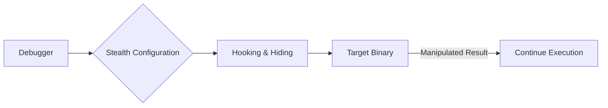

# 🛡️ Log 02: Bypassing Protections (Advanced)

> *"Melumpuhkan pertahanan: Strategi ofensif untuk menetralkan mekanisme deteksi tanpa merusak integritas program."*

---

## 🎯 Learning Objectives
- [ ] Memahami perbedaan antara *Static Patching* dan *Dynamic Patching*.
- [ ] Menguasai manipulasi register `EAX` untuk memalsukan nilai balik (return value) API.
- [ ] Menggunakan konfigurasi *Debugger Stealth* secara profesional.

---

## 🏗️ Strategi Netralisasi

---

## 🧠 Analisis Teknik Bypass

### 1. Dynamic Patching (Register Manipulation)

Teknik ini dilakukan saat program sedang berjalan di debugger (Runtime).

* **Contoh Kasus**: Program memanggil `IsDebuggerPresent` untuk mengecek status debug.
* **Prosedur**:
1. Pasang *breakpoint* pada fungsi `IsDebuggerPresent`.
2. Saat program berhenti di fungsi tersebut, *step out* (Ctrl+F9).
3. Pada register `EAX`, ubah nilainya menjadi `0`. Ini memaksa program percaya bahwa tidak ada debugger yang aktif.

### 2. Static Patching (Binary Modification)

Jika kamu tidak ingin bergantung pada debugger setiap saat:

* **Metode**: Mengubah instruksi biner secara permanen menggunakan Hex Editor (seperti `HxD`) atau fitur *patching* di `x64dbg`.
* **Instruksi**: Mengganti `JZ` (Jump if Zero) atau `JNZ` (Jump if Not Zero) dengan `NOP` (No Operation) untuk menetralkan *jump* yang menuju ke fungsi `exit()`.

### 3. Debugger Stealth (ScyllaHide)

Ini adalah metode paling efisien untuk menangani deteksi tingkat sistem. `ScyllaHide` bekerja dengan melakukan *hooking* pada fungsi sistem (`NtQueryInformationProcess`, dll) untuk memanipulasi informasi yang dikembalikan ke program target agar seolah-olah proses tersebut berjalan normal.

---

## ⚠️ Professional Insight

> **Golden Rule**: Selalu buat *backup* biner asli sebelum melakukan *patching*. Jika program mengalami *crash* setelah di-*patch*, kemungkinan besar kamu merusak struktur logika atau mengubah *offset* yang mengakibatkan instruksi selanjutnya tidak sinkron (misal: *jump* yang melompat ke alamat yang salah).

---

*Status: 🛡️ Phase 04 - Log 02 Enhanced Complete.*

