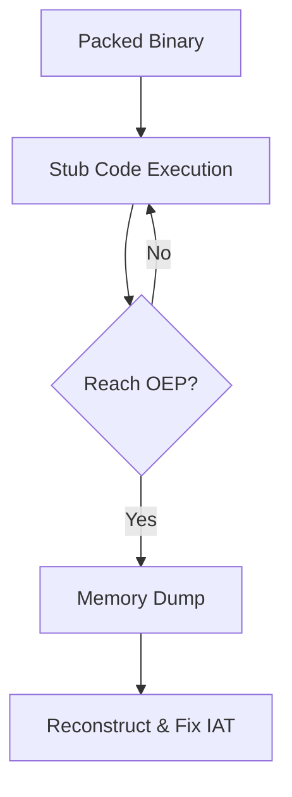

# 🛡️ Log 03: Unpacking Basics (Advanced)

> *"Menembus lapisan pelindung: Teknik menemukan Original Entry Point (OEP) pada biner yang terkompresi."*

---

## 🎯 Learning Objectives
- [ ] Memahami siklus hidup biner terbungkus (Stub Loader -> OEP).
- [ ] Menguasai teknik "ESP Heritage" untuk menemukan OEP dengan cepat.
- [ ] Menggunakan dump tool untuk merekonstruksi file asli.

---

## 🏗️ Alur Unpacking

---

## 🧠 Analisis Teknis

### 1. Mengenal Stub Loader

Biner yang di-*pack* (seperti UPX, ASPack, atau VMProtect) tidak langsung menjalankan kode asli. Ia menjalankan sebuah *stub code* yang bertugas:

* Mendekompresi bagian utama program ke memori.
* Mengatur ulang alamat fungsi (Import Address Table/IAT).
* Melompat ke **Original Entry Point (OEP)**.

### 2. Teknik ESP Heritage (Hard Breakpoint)

Ini adalah metode paling populer untuk menemukan OEP secara manual:

1. **Analisis Awal**: Saat program pertama kali dimuat, amati instruksi `PUSHAD`. Instruksi ini menyimpan semua status register ke stack.
2. **Break on Access**: Setelah `PUSHAD` dieksekusi, perhatikan register `ESP` (Stack Pointer). Klik kanan pada alamat di stack tersebut di *Dump Panel*, lalu pilih **"Breakpoint -> Hardware, Access -> Word"**.
3. **Run**: Lanjutkan eksekusi (`F9`). Program akan berhenti tepat saat stub selesai melakukan dekompresi dan sedang menyiapkan loncatan ke OEP.
4. **Find OEP**: Biasanya, setelah breakpoint terpicu, kamu akan melihat instruksi `JMP` atau `CALL` yang membawa kamu ke blok kode utama program.

### 3. Rekonstruksi (Dump & Fix)

Setelah mencapai OEP:

* Gunakan **Scylla** (terintegrasi di x64dbg) untuk melakukan *dump* isi memori ke file `.exe` baru.
* Lakukan **IAT Autosearch** dan **Get Imports** untuk memperbaiki tabel fungsi agar biner hasil *dump* bisa berjalan mandiri (tanpa tergantung stub aslinya).

---

## ⚠️ Professional Insight

> **Peringatan IAT**: Masalah paling umum setelah melakukan *dump* adalah program tidak mau berjalan. Hal ini biasanya terjadi karena tabel alamat fungsi (IAT) belum terekonstruksi dengan sempurna. Pastikan kamu selalu melakukan *fix* pada IAT menggunakan Scylla sebelum menjalankan file hasil dump.

---

*Status: 🛡️ Phase 04 - Log 03 Enhanced Complete.*

