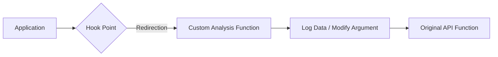

# 🛡️ Log 04: API Hooking & Behavioral Analysis (Advanced)

> *"Menjadi perantara: Menginterupsi komunikasi antara aplikasi dan sistem operasi untuk membongkar rahasia di balik layar."*

---

## 🎯 Learning Objectives
- [ ] Memahami konsep *Inline Hooking* dan *Import Address Table (IAT) Hooking*.
- [ ] Menggunakan *Debugger Scripting* untuk otomatisasi pemantauan API.
- [ ] Menganalisis parameter fungsi API untuk mengungkap data sensitif (string, kunci enkripsi, dll).

---

## 🏗️ Mekanisme Hooking

---

## 🧠 Analisis Teknis

### 1. IAT Hooking vs Inline Hooking

* **IAT Hooking**: Debugger/Tools memodifikasi *Import Address Table*. Ketika program memanggil `CreateFile`, ia diarahkan ke fungsi kustom kita sebelum kembali ke API asli.
* **Inline Hooking**: Mengubah instruksi pertama pada fungsi API asli (misal `MessageBoxA`) menjadi `JMP` menuju kode kita. Ini jauh lebih kuat namun lebih rentan dideteksi oleh mekanisme *integrity check*.

### 2. Memantau Parameter di Stack/Register

Seringkali, fungsi API seperti `WriteFile` menyimpan data yang akan ditulis di sebuah *buffer*.

* **Analisis**:
1. Pasang *breakpoint* pada fungsi API target (misal: `WSASend` untuk melihat data jaringan).
2. Saat *breakpoint* terpicu, lihat register `RDX` atau `R8` (pada arsitektur x64, ini adalah tempat parameter disimpan).
3. Gunakan **"Follow in Dump"** untuk melihat konten *buffer* sebelum fungsi tersebut dienkripsi atau dikirim ke *socket*.

### 3. Otomatisasi dengan Scripting

Daripada melakukan *manual tracing*, kita bisa menulis skrip sederhana di x64dbg:

* Contoh: `bp CreateFileW, { log "File yang dibuka: {unicode:[rdx]}"; ret; }`
* Skrip ini secara otomatis akan mencatat setiap file yang diakses oleh program ke jendela *log* debugger.

---

## ⚠️ Professional Insight

> **Strategi Anti-Tracing**: Beberapa malware modern melakukan *direct syscall* (memanggil kernel secara langsung) untuk melewati API Hooking. Jika kamu tidak melihat aktivitas API padahal program sedang aktif, itu tandanya program tersebut melakukan *direct syscall*. Kamu harus beralih ke tingkat kernel atau menggunakan *instruction tracing* untuk melacaknya.

---

*Status: 🛡️ Phase 04 - Log 04 Enhanced Complete.*

